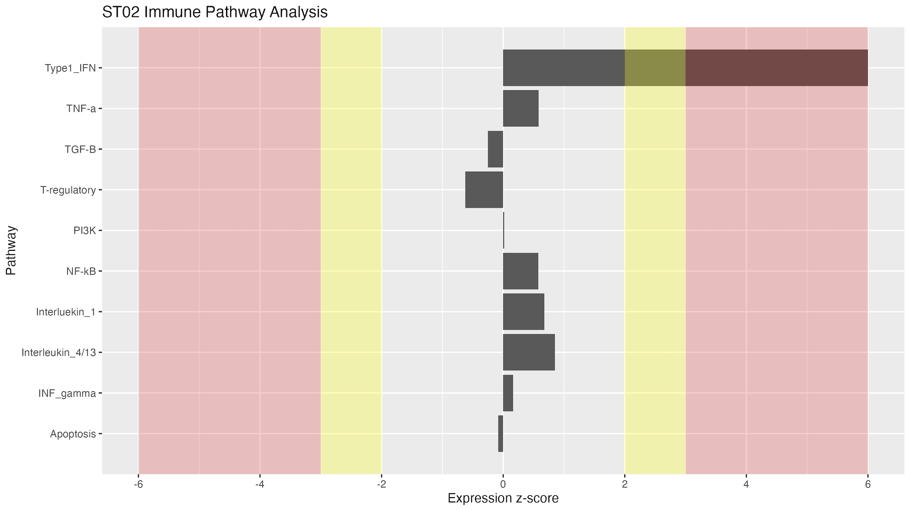
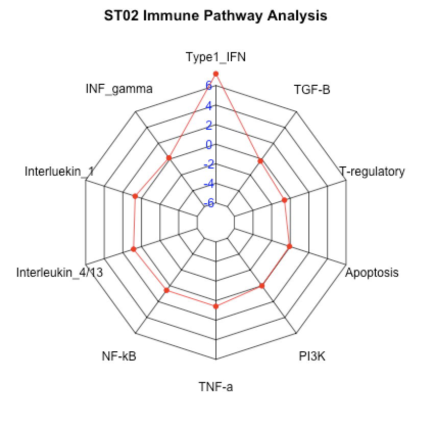
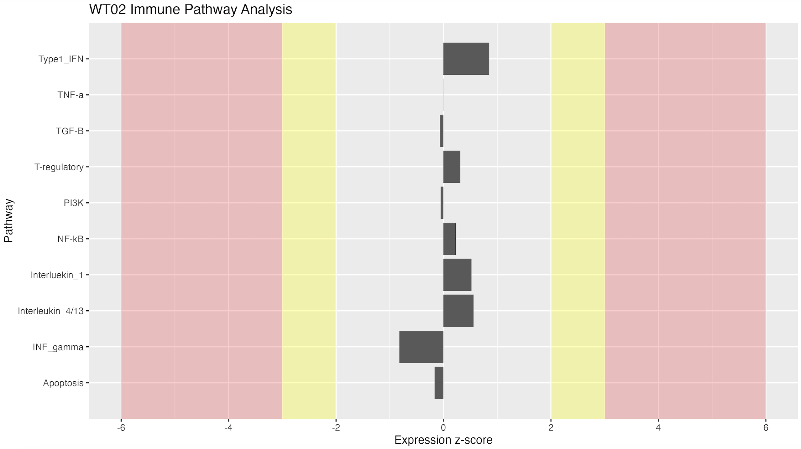
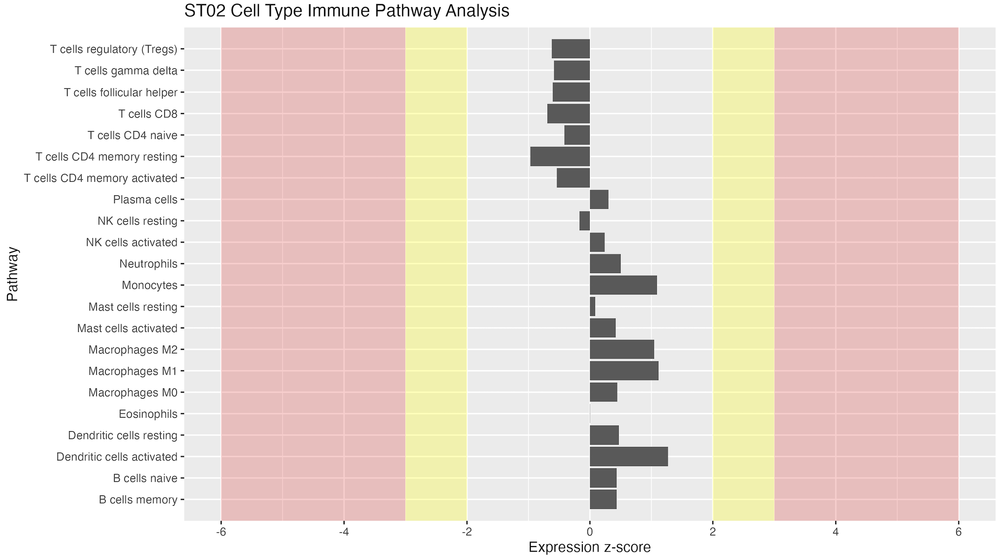

# Visualize differential gene module expression

This R script uses pre-defined gene modules (groups of genes) and compares the expressions between individual 'treatment' or 'patient' samples and a control population. It automatically generates gene-module expression plots to visualize the expression of each module compared to the control population. Gene modules with abnormally high or low expression can be identified.

The basic methodology:
1) Import transcript abundances from Kallisto
2) Convert transcripts to genes
3) Normalize and transform the abundances (TMM normalization, CPM normalization, and Log2 transformation)
4) Calculate the mean and standard deviation of every gene in the 'control' group
5) Calculate the expression z-score for each gene in every sample in the 'treatment' group
6) Calculate gene module expression by by averaging the z-scores for every gene in the module
7) Visualize results

The gene modules in the 'data' folder were created via a literature review conducted by myself and supervised by Dr. Ashish Marwaha, MD PhD, at the University of Calgary. You are able to customize the gene modules and add/remove modules as you wish.

## Preprocessing (before running ImmunomeAnalyzeR)

Samples are required to be pre-processed using Kallisto pseudo-aligner.

To create the Kallisto index:
```
kallisto index -i [outputIndexName] -t [# of threads] [reference_cDNA_fasta_file]
```

To run Kallisto quantification:
```
kallisto quant -i [index] -o [output] pairA_1.fastq pairA_2.fastq pairB_1.fastq pairB_2.fastq
```

## Running ImmunomeAnalyzeR

### Description
Compares two groups (ex. treatment vs. control, healthy vs. disease, etc.)
by comparing expression of groups of related genes.

### Details
The config.yml file must be configured prior to running the script.

* 'study_design_file': Path to the tab-delimited text file that contains two
   columns: a sample identifier (ID) and a group. See
   'study_design_template.txt'.

* 'treatment_name': The name of the group of interest in the study design
   file. Usually this is 'patient'. The script will generate a plot for each
   treatment sample.

* 'data_dir': Path to the directory with Kallisto results. The directory must
  be structured as the raw Kallisto output: one sub-directory for each
  patient ID with an 'abundance.h5' file inside:
  data_dir
  |---SampleID1
  | |---abundance.h5
  |---SampleID2
  | |---abundance.h5
  |---SampleID3
  | |---abundance.h5
  ...

* 'gene_sets': path to gene modules CSV (disease/molecular pathway related
  modules)

* 'cell_sets': Path to the gene modules CSV (cell-related modules)

* 'visualized_control_samples': Boolean. If false only treatment samples are
  visualized.

* 'generate_bar_plot': Boolean. Generate gene-sets module visualizations

* 'generate_cell_plots': Boolean. Generate cell-sets module visualizations.

* 'generate_spider_plot': Boolean. Generate the above plots as a spider plot

### Output
Generates gene module expression plots for every treatment (and control)
sample for every gene module in the 'generated' directory. Also, a
composition plot is generated that visualizes the log2 expression composition
for each sample.

### To run
Using R version 4.5 or later, navigate to the ImmunomeAnalyzeR directory and run the following command:
```
Rscript immunomeAnalyzeR.R <CONFIG_SETTING>
```
Where <CONFIG_SETTING> is the name of the settings group to use (ex. 'default' or 'production').

Note: Please be patient running for the first time, the required R libraries will need some time to download and install.

### Example output





### Questions?
Email me at benmckgreen@gmail.com
